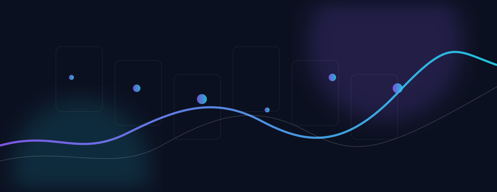

# Aykhan K. — Product-minded engineering

I explore how useful technology products are imagined, structured, and brought to life. My work sits at the intersection of **product thinking, systems design, computer science foundations, and AI-assisted implementation**.

## Selected projects

| Project | Focus |
| --- | --- |
| [ZTerminal](https://github.com/zephyriaa/zterminal) | A unified workspace for charting, strategy research, backtesting, order flow, and market analysis. |
| [Quant Backtest Engine](https://github.com/zephyriaa/quant-backtest-engine) | A learning-oriented Python engine for ORB strategies and volatility regimes. |
| [ZMusic Android](https://github.com/zephyriaa/zmusic-android) | A Kotlin and Jetpack Compose architecture study for a modern audio interface. |
| [Algorithms Core](https://github.com/zephyriaa/algorithms-core) | A structured collection of algorithms, data structures, and tests. |

## How I work

I start from the user problem, map the workflow, define system boundaries, identify risks, and then choose the smallest useful implementation. I care about making complex ideas understandable through requirements, diagrams, prototypes, and honest documentation.

## Current direction

I am building foundations in Python, Git, testing, APIs, application architecture, quantitative tools, cybersecurity concepts, and Android product design while preparing for undergraduate study in Computer Science and Cybersecurity.

## Connect

The best places to connect are [LinkedIn](https://www.linkedin.com/in/aykhan-kherimli-2792b7430) and [GitHub](https://github.com/zephyriaa).

> This profile is a record of learning and experimentation. Project descriptions distinguish product direction, architecture studies, prototypes, and production implementation wherever possible.

## License

See [LICENSE](LICENSE).
